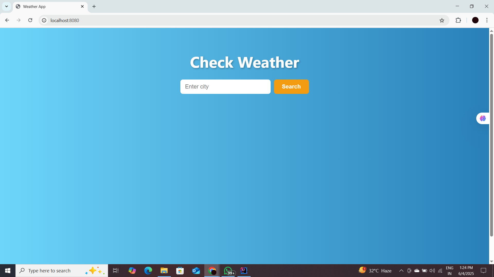
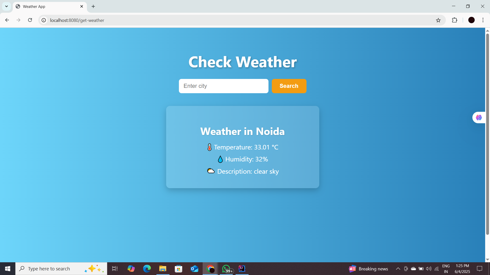
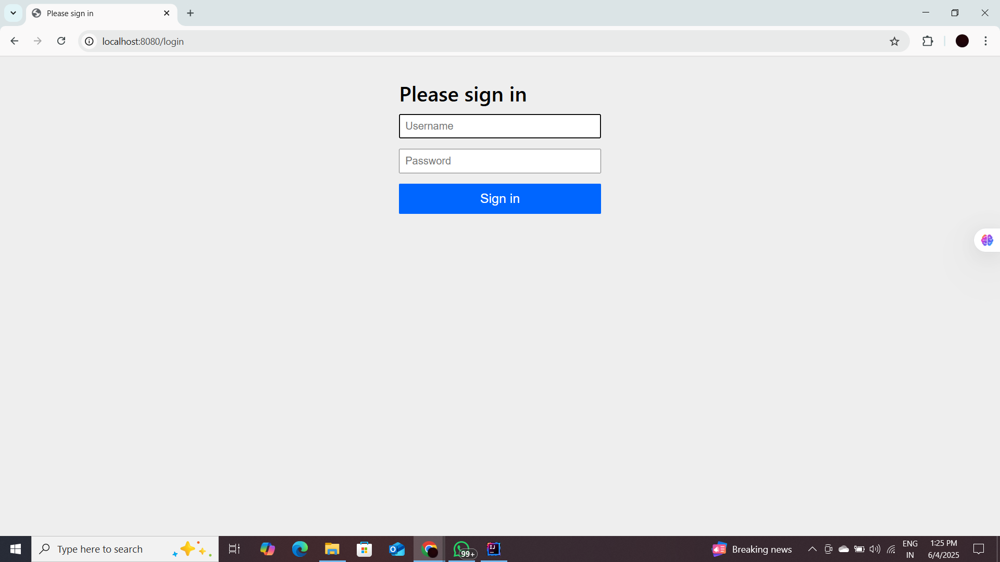

# Weather App

This is a simple Spring Boot weather application that fetches weather data from OpenWeatherMap API.

## Features

- Search weather by city
- Displays temperature, humidity, and weather description

## Screenshot

